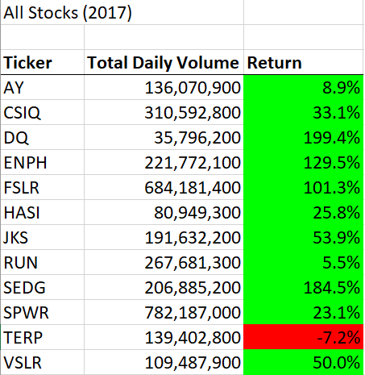
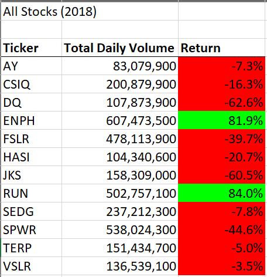
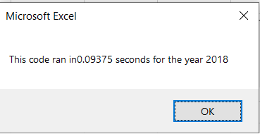
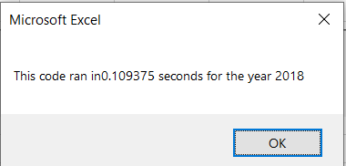

# Stock-analysis
#Overview of Project: In this project we used VBA, Excel's programming langugae in order to create a macro that helps us analyze a set of data easily. When we run the macro we created we can determine the return of any stock and decide if we want to invest in it. 

#Results: 

#Stock Analysis Results

 

#2017
As we can see every stock in the year 2017 had a good performance except 'TERP'which had a negative return of -7.2%. 
#2018
Nonetheless, next year was not great for the market. As we can see in the table only 'ENPH' and 'RUN' had a positive return with a value of 81.9% and 84%, respecteviley. 

#Code Performance Test

 , 

According to the performance test we ran, we can see that the original code that we wrote runs faster with a time of 0.09 seconds. Our refracted code ran in a time of 0.10 seconds.

##Summary: In a summary statement, address the following questions.
What are the advantages or disadvantages of refactoring code?
One advantge of refactoring code is that you can modify an existing code to work for an endless amount of data sets, therefore the code becomes very versatile. 
A disadvantage we can face is that refactoring can be very time consuming and confusing, you'll never know how much time it can take and in certain points you might not know where to go with the code or how to solve other problems.

How do these pros and cons apply to refactoring the original VBA script?
For the original VBA script it was not time consuming but rather confusing, because we had to determine new variables and new For Loops. 
